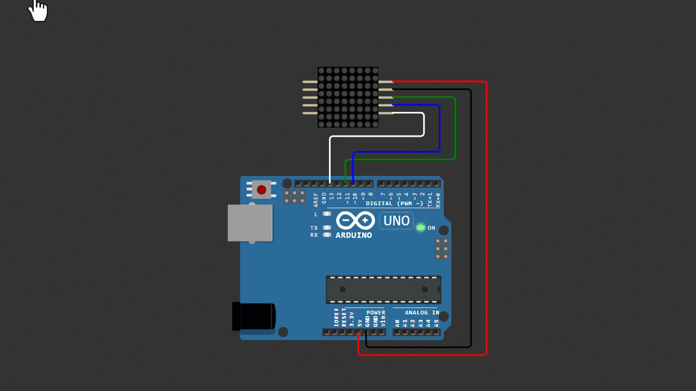

# Arduino MAX7219 8x8 Dot Matrix Arrow Direction Switch Animation

A beginner-friendly Arduino project that demonstrates how to create a smooth arrow animation (right ↔ left) on an 8x8 LED dot matrix using the MAX7219 module.

This project focuses on clean animation flow without glitches when switching directions.

---

## 📌 Project Overview

This project displays a diagonal arrow animation that moves across the LED matrix and switches direction smoothly.

Animation behavior:

- Arrow moves to the right ( > )  
- Short pause  
- Arrow switches to the left ( < )  
- Repeats continuously  

The MAX7219 handles multiplexing internally, making the implementation simple and stable for beginners.

---

## 🧰 Components Required

- Arduino Uno / Nano  
- MAX7219 8x8 Dot Matrix Module  
- Jumper Wires  

---

## 🔌 Wiring Connections

| MAX7219 | Arduino |
|--------|--------|
| VCC    | 5V     |
| GND    | GND    |
| DIN    | D11    |
| CS     | D10    |
| CLK    | D13    |

---

## 📷 Wiring Diagram

> Make sure your wiring matches the diagram before uploading the code.

---

## 💻 Arduino Code

You can download the Arduino sketch here:

[Download Arduino Code](Arduino_MAX7219_8x8_Dot_Matrix.ino)

Or open the `.ino` file directly inside this repository.

---

## 🚀 Getting Started

1. Connect all components according to the wiring table.
2. Upload the provided Arduino sketch.
3. Power the Arduino.
4. Watch the arrow animation run automatically.

---

## 🧠 Learning Concepts

This project helps you understand:

- LED matrix control using MAX7219  
- Frame-based animation  
- Direction switching logic  
- 2D array manipulation  
- Basic Arduino timing (millis & delay)  

---

## 🔄 Possible Improvements

You can expand this project by adding:

- Speed control using potentiometer  
- Multiple MAX7219 modules (long display)  
- Scrolling text + animation combo  
- Sound reactive animation  
- Optimized version using `setRow()`  

---

## 🎥 Video Tutorial

Watch the full tutorial on YouTube:

👉 (Add your video link here)

In this video, you will see:
- Wiring setup  
- Code explanation  
- Animation demo  
- Direction switching  

---

## 📄 License

This project is open-source and free to use for educational purposes.

---

Happy Coding 🚀
